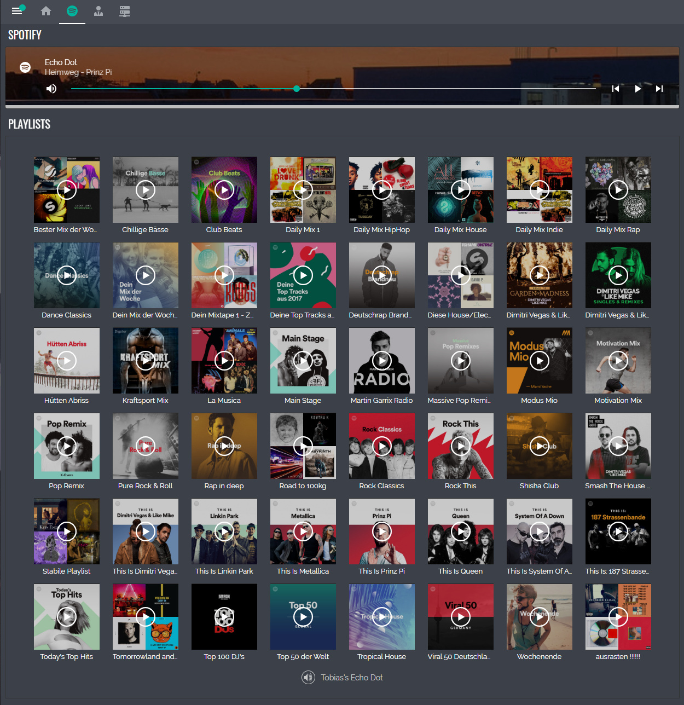

## Home Assistant Spotify Lovelace Card
**DISCLAIMER**: *This project is a private open source project and doesn't have any connection with Spotify.*

Original card by: @fondberg: https://github.com/custom-cards/spotify-card

Card modified to a spotify-like playlist look:



## Setup

Add the spotify-card.js as a resource to the ui-lovelace.yaml (and copy it to the respective folder)

```
resources:
- url: /local/custom-lovelace/custom-spotify-card/spotify-card.js
  type: module
```
  
For adding the card in the lovelace config and setting up the spotify console, please refer to the original card as the procedure is the same: https://github.com/custom-cards/spotify-card#installation 
